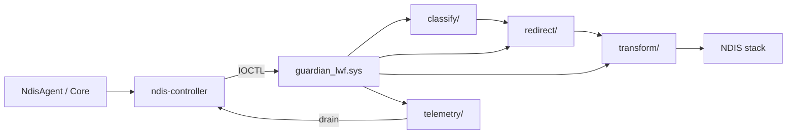

# WireSentinel NDIS Architecture

Phase 12 introduces an NDIS Lightweight Filter (LWF) path that complements the existing WFP Guardian driver in WireSentinel-Kernel. The filter sits in the NDIS datapath for packet classification, redirect, obfuscation transforms, and telemetry export.

## Components

| Layer | Crate / Path | Role |
|-------|--------------|------|
| Agent SDK | `sdk/` | High-level agent: classify, route sync, transform, telemetry |
| Controller | `controller/` | IOCTL client for `\\.\WireSentinelNdis` (Windows) / stub (Linux) |
| Packet engine | `packet-engine/` | Userspace classifier with process/app/route/protocol/flow tracking |
| Route engine | `route-engine/` | `KernelRouteAssignment` + route sync to driver |
| Obfuscation | `obfuscation/` | Transform, LWO, cover-traffic engines aligned with `ObfuscationPreset` |
| Telemetry | `telemetry/` | `KernelTelemetryV2` ring buffer + batch drain |
| Kernel filter | `ndis-filter/` | NDIS LWF driver skeleton |
| Shared IPC | `shared/` | C headers mirrored by Rust `controller` types |

## Data flow

## IOCTL surface

Device path: `\\.\WireSentinelNdis`

| IOCTL | Purpose |
|-------|---------|
| `IOCTL_NDIS_GET_DRIVER_STATE` | Driver lifecycle + counters |
| `IOCTL_NDIS_SET_ROUTE` | Per-flow route assignment |
| `IOCTL_NDIS_CLEAR_ROUTE` | Remove flow route |
| `IOCTL_NDIS_SYNC_ROUTES` | Bulk route sync |
| `IOCTL_NDIS_SET_TRANSFORM_PROFILE` | Obfuscation preset/modules |
| `IOCTL_NDIS_SET_COVER_TRAFFIC` | Cover-traffic profile |
| `IOCTL_NDIS_SYNC_REDIRECT` | Redirect rules |
| `IOCTL_NDIS_GET_TELEMETRY_SUMMARY` | Aggregate counters |
| `IOCTL_NDIS_DRAIN_TELEMETRY` | Ring buffer batch drain |

## Obfuscation presets

Presets mirror WireSentinel Core `ObfuscationPreset`:

| Preset | Modules |
|--------|---------|
| Disabled | none |
| Basic | padding |
| Balanced | padding, jitter |
| Aggressive | fragment, padding, jitter, camouflage |
| Lwo | lightweight WireGuard obfuscation |

## Build matrix

- **Linux CI**: `cargo test --workspace` (controller uses non-Windows stubs)
- **Windows**: WDK build via `ndis-filter/guardian_lwf.vcxproj` and `scripts/run-tests.ps1`

## Relationship to WireSentinel-Kernel

`ndis-controller` follows the same pattern as `guardian-controller`: shared C headers, Rust IOCTL mirror, `cfg(windows)` device client, and `cfg(not(windows))` stubs for cross-platform unit tests.
